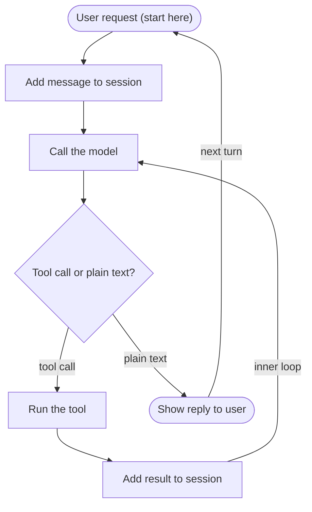

# Building a Coding Agent from Scratch

## Intro

I built a small coding agent from scratch, called Corvid. It reads and edits files, runs commands, and works through a task on its own. Underneath, it's mostly a loop around an LLM. This is a writeup of how it works, and what I learned building it.

## What is an agent

An agent is a system where the LLM drives its own path to get a task done. It decides what to do at each step. That's what separates an **agent** from a **workflow**, where the LLM only moves through predefined code paths. Both are collectively referred to as **agentic systems**.

Under the hood, it's brain(the LLM) + harness(the loop that orchestrates it) + hands(tools and sandboxes) + session(the log of session events). Alone, an LLM is just a next token predictor. It can't do much other than spit out some text. So, in order to turn a model into a super-useful agent, we enhance it with these augmentations:

- **Session** - It's the scratchpad for the agent, or basically, everything that the LLM knows in the current conversation other than its training data, should live here. It's an append-only log. This can be in-memory or on disk. Usually stored on disk (a database or files) for persistence. For simplicity, we kept it here, in memory only. Model/LLM doesn't have any way to remember the current conversation, so we store everything from the conversation in this session log, and pass it in every request as part of the context to the model.
- **Harness** - The loop that runs the agent. Every iteration in this loop calls the model and appends a log as progress of the session. 
- **Tools** - How the agent acts on its environment, like reading a file or running a command.
- **Sandbox** - The isolated environment where the tools run, so the agent can't harm the real system. Corvid doesn't do this yet. The tools run directly for now, and we'll cover sandboxing in a later part.


## The agent loop

Now let's see how these pieces work together when the agent runs.

There are two loops here, an outer one and an inner one.

**The outer loop** runs once per user turn:

1. Take the user input.
2. Append it to the session.
3. Run the inner loop.
4. Print the final reply, then wait for the next input.

**The inner loop** is the agent doing the actual work. It repeats until the model is done:

1. Call the model. Pass the session as context, and the tool schema as an argument.
2. The model replies in one of two ways:
   - **Plain text.** It's done. Break the loop and show the reply to the user.
   - **A tool call.** It wants to act. We run the tool, append the output to the session, and go back to step 1, so the model can use the result and decide what's next.




## Tool calling

The most important thing to understand: the model can't run anything itself. It has no hands. When an agent "uses a tool", the model is only asking for it. It outputs a bit of text that says "run this tool with these arguments". Our harness is what actually runs it. The model decides, our code does.

So how does the model know which tools exist? We tell it. On every call, along with the session, we pass a **tool schema**. The schema describes each tool: its name, what it does, when to use it and when not to, and what arguments it takes. The model reads this and decides whether to call a tool.

When it wants one, the reply comes back as a **tool call** instead of plain text. The tool call is just text too: a tool name and its arguments. For example, if you ask it to read a file, the tool call looks like this:

```json
{ "name": "read_file", "arguments": { "path": "main.py" } }
```

We read this, run `read_file("main.py")` ourselves, and feed the output back to the model as the result.

## Getting the fundamentals right

A few principles matter more than the code itself.

**1. Control what you can.** The LLM is the one part we can't fully control. It's probabilistic, so it won't always do the same thing. But everything around it, the harness, the tools, and the session, is deterministic code that we own completely. So the rule is simple: get the most out of the parts you control. When something needs handling, fix it in the deterministic parts first, instead of begging the LLM to behave.

This is really about the ACI, the Agent Computer Interface. Think of HCI, the Human Computer Interface. A screen, keyboard, and mouse are all designed around what a human can easily do. ACI is the same idea, but for the agent. The tools and the code around them should be designed around what makes the model's job easy. Most of the time, making a tool simpler and clearer does more than tweaking the system prompt. If the model keeps misusing a tool, improve the tool before you touch the prompt.

**2. Keep it simple.** Start with a plain loop, and add complexity only when you actually need it. It's tempting to reach for a framework, but a framework hides the very things you're trying to understand, and it quietly decides how your agent behaves. Most of what you need is a few lines of your own code. Start simple, and grow only when needed.

**3. Be transparent.** Show what the agent is doing. When it calls a tool, print it. The user should be able to follow the agent's steps, not just see the final answer.

**4. Write a tight system prompt.** The system prompt sets the agent's role and rules. Keep it short and specific. Say what the agent is, when to use tools and when not to, and what to do when it's unsure (ask, don't guess). Put the important rules first. A short, sharp prompt beats a long rambling one.

## What broke

I wanted to keep this free and offline, so I started with a local model. Local models are quantized (compressed) to fit on a normal laptop. A 7B model at 4-bit precision needs roughly:

```
7B params x 0.5 bytes (4-bit) = ~3.5 GB   (~4.7 GB with overhead)
```

That fits comfortably on a 16 GB machine. I ran it with Ollama, which uses llama.cpp under the hood as its inference engine.

It worked fine for chatting. But it fell apart on tool calls. Instead of returning a proper structured tool call, the small model would often just print the tool call as plain text in its reply. The harness had no structured call to run, so the agent couldn't act reliably. Smaller local models are simply weaker at the strict formatting that tool calling needs.

This was easy to fix, because the model is a swappable component. Everything around it stays the same. I moved from the local model to a Groq API call using their gpt-oss model, which handles tool calls reliably. Only the config changed: the URL, the model name, and an API key. The harness, the tools, and the loop never moved.

The lesson: tool-calling reliability is a real thing to check when picking a model, and building the harness model-agnostic from the start is what made the switch a one-line change.

## TL;DR

At its core, an agent is a loop, some tools, and enough tokens. The LLM is just a next token predictor. Everything beyond that, remembering the conversation, reading files, running commands, comes from the code around it, not from the model.

This is only the first level. Corvid can read, edit, and run things locally. Next comes running it safely in a sandbox, then routing it through my own inference layer, then measuring how well it does. But all of it sits on this same small loop.